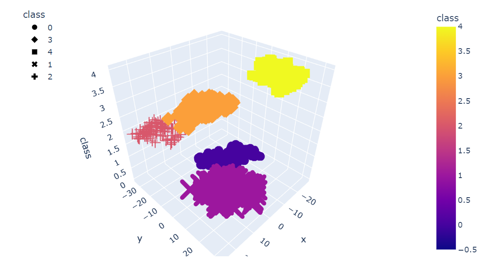

# Unsupervised-ML-Myopia-Clusters
In this assignment, the unsupervised learning was used to fit the MYOPIA data to the machine learning models. Several clustering algorithms were used to explore if the patients can be placed into distinct groups of patients. This would help us to analyze them separately and to find better ways to predict myopia, or nearsightedness. 

### Part 1: Prepare the Data

1. Used Pandas DataFrame to read `myopia.csv`.

2. Removed the "MYOPIC" column from the dataset.

3. Verified if the data has any "Nulls" or duplicates

4. Standardize the dataset (using StandardScaler) so that columns that contain larger values do not influence the outcome more than columns with smaller values.

### Part 2: Apply Dimensionality Reduction

1. Performed dimensionality reduction with PCA. This reduced the number of columns from 14 to 10 features.
    -   preserved 90% of the explained variance in dimensionality reduction.

2. Further reduced the dataset dimensions with t-SNE. 

3. Created a scatter plot of the t-SNE output. Looks like there are 5 distinct clusters.

### Part 3: Perform a Cluster Analysis with K-means

Created an elbow plot to identify the best number of clusters. 

* Used a `for` loop to determine the inertia for each `k` between 1 through 10. 

* Determined where the elbow of the plot is, and at which value of `k` it appears.

### Used the principal components data with the K-means algorithm with a `K value of 5 & 6`

#### `With K value of 5:`

  

#### `With K value of 6:`

  

### Part 4: Make a Recommendation
#### The elbow curve and the 3D scatter plots show that the patients can be grouped into 5 or 6 clusters. I would recommend to group the patients into 5 clusters because the elbow curve is more flat after 5 and we may be over fitting the data if we group the patients into 6 clusters.

